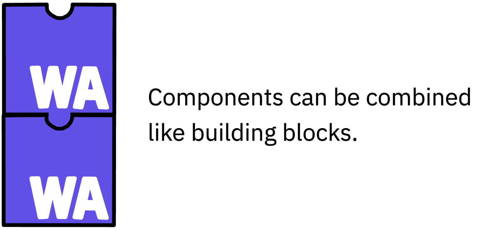
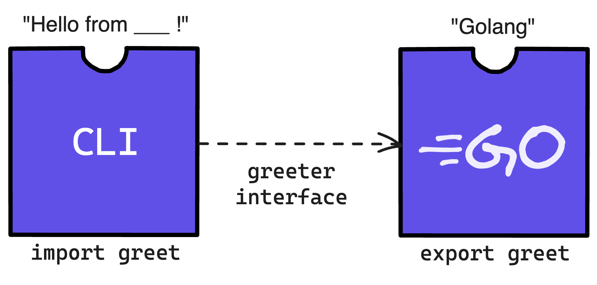

As the WebAssembly component ecosystem grows, tooling like [**WebAssembly Compositions (WAC)**](https://github.com/bytecodealliance/wac) is emerging to make it easier to take advantage of components' unique properties.

<!--end_excerpt-->

**WebAssembly components** are units of portable, interoperable code that interact exclusively through interfaces. In addition to bringing the efficient, sandboxed portability of a WebAssembly binary and the interoperability of a common interface language, components are designed to be **composable**: you can take small, portable, reusable units of code and combine them into more complex systems. 

If Component A exposes (or *exports*) a function to outside code, and Component B requires (or *imports*) code using the same interface defined in [WebAssembly Interface Type (WIT)](https://component-model.bytecodealliance.org/design/wit.html) interface description language, then the two components can be combined like building blocks. This simple pattern lies behind much of components' flexibility and power, enabling use-cases ranging from virtualized components with `wasi-virt` to plug-and-play libraries from one language being composed into an app built with another. 
  

  
**WAC** (pronounced "whack") is a CLI tool for combining (or **composing**) WebAssembly components. It enables users to compose components either imperatively (via the `plug` subcommand) or declaratively, using a superset of WIT also called WAC.  Users can define import/export relationships in a `.wac` file, provide components' `.wasm` files to build from, and then create a composed component (i.e., whack it all together) with `wac encode`. 

WAC was created by [Peter Huene](https://github.com/peterhuene) and has since expanded to a Bytecode Alliance-hosted project with maintainers and contributors including [Calvin Prewitt](https://github.com/calvinrp), [Brian Hardock](https://github.com/fibonacci1729), and [Ryan Levick](https://github.com/rylev), who recently released **WAC v0.3.0**. Building on Peter and other contributors' work on `wasm-compose` and other ecosystem tooling, WAC provides a powerful, standards-driven way to put the [Component Model](https://component-model.bytecodealliance.org/introduction.html)'s composability into practice.

## Why compose?
 
Once you have a model of composability, a tool like WAC enables you to start putting pieces of code together in increasingly complex ways. Maybe you'd like to deploy a group of microservices together as a singular component, or patch over a dependency by composing it right into your component. Whacking (`wac`ing?) components together makes it possible. 

In the near future, WAC will support transform expressions, so that users can include a set of files in a composition. At the 2024 Plumbers' Summit, Peter described how transformers will work in WAC:

> These will also be implemented as WebAssembly components...so where you see syntax using these expressions, what the WAC compiler does is basically go to a registry, it says, "Give me this transformer." It downloads it and then executes it with Wasmtime, gives it everything it needs&mdash;the configuration, the component to transform&mdash;and out pops another component. Then WAC uses that component later on in its instantiations internally. So this really becomes a powerful primitive to extend WAC to do things that we haven't dreamed of yet. 

At present, WAC can transform the component dev experience by enabling you to pull component dependencies from a registry when you compose. This can cut down on copy-pasting and provide a way to combine code distributed across teams into something deployable. 

Peter envisions this pattern going much further. "I think where we want to go is having a way of taking these complex applications and distributing them across a fleet of computers," he told me in a conversation for this post. "That's the long-term vision I have for some of this composition stuff, is to be able to describe a distributed application in a way that makes sense and can automatically be deployed and balanced."

## Example: WACing together a CLI component

With WAC v0.3.0, the `plug` subcommand makes simple compositions that match imports and exports extremely straightforward:

```shell
wac plug importer.wasm --plug exporter.wasm -o composed.wasm
```


In this demo, we'll explore how you can encode more complex compositions using the WAC language.

Since WAC is a superset of WIT, getting started is straightforward for anyone familiar with components. We can run a quick hands-on demo that only requires [Wasmtime](https://github.com/bytecodealliance/wasmtime) (or another Wasm runtime that supports components), [`cargo`](https://doc.rust-lang.org/cargo/getting-started/installation.html), and [WAC](https://github.com/bytecodealliance/wac) itself (with compiled Wasm components provided).

First we'll install WAC:

```shell
cargo install wac-cli
```
Clone or download the example repo:

```shell
git clone https://github.com/ericgregory/wac-demo.git
```
[The repo](https://github.com/ericgregory/wac-demo) contains an adaptation of a demo given by Peter at the Plumbers' Summit. It includes three components: a `greeter` written in Go and `terminal` and `cli` components written in Rust. We'll use the composition instructions defined in our `composition.wac` file to combine them into a single component that returns CLI output.  

If you would like to compile the components on your own, you'll need tools to compile to a WASI P2 target from Rust and Go. (You can find instructions for doing so in the repo.) Additionally, we'll use [`wasm-tools`](https://github.com/bytecodealliance/wasm-tools) to look at our compiled components' WIT. 

If we look at the Go code in the `golang` directory, we'll see that it exports a function `greet` on the `greeter` interface that returns a string value `Golang`. 



You can see the WIT for the compiled component with `wasm-tools`:

```shell
wasm-tools component wit ./golang/build/greeter.wasm
```
```wit
package root:component;
world root {
  import wasi:cli/environment@0.2.0;
  import wasi:io/error@0.2.0;
  import wasi:io/streams@0.2.0;
  import wasi:cli/stdin@0.2.0;
  import wasi:cli/stdout@0.2.0;
  import wasi:cli/stderr@0.2.0;
  import wasi:clocks/monotonic-clock@0.2.0;
  import wasi:clocks/wall-clock@0.2.0;
  import wasi:filesystem/types@0.2.0;
  import wasi:filesystem/preopens@0.2.0;
  import next: func() -> string;

  export greet: func() -> string;
}
```

Meanwhile, the Rust-based `cli` component will print `Hello from` if it finds any messages via the `greet` function that it imports on the `greeter` interface. Here's the WIT for `cli`:

```shell
wasm-tools component wit ./cli/target/wasm32-wasi/debug/cli.wasm
package root:component;
```
```wit
world root {
  import wasi:cli/environment@0.2.0;
  import wasi:cli/exit@0.2.0;
  import wasi:io/error@0.2.0;
  import wasi:io/streams@0.2.0;
  import wasi:cli/stdin@0.2.0;
  import wasi:cli/stdout@0.2.0;
  import wasi:cli/stderr@0.2.0;
  import wasi:clocks/wall-clock@0.2.0;
  import wasi:filesystem/types@0.2.0;
  import wasi:filesystem/preopens@0.2.0;
  import greet: func() -> string;

  export wasi:cli/run@0.2.0;
}
```

Finally, the `terminal` component returns an empty string and completes the sequence of events in our composition.

Let's take a look at `composition.wac`:

```wit
package demo:service;

let terminal = new demo:terminal {
    ...
};

let golang = new demo:golang {
    next: terminal.greet,
    ...
};

let cli = new demo:cli {
    greet: golang.greet,
    ...
};

export cli ... ;
```
The WAC language currently includes three kinds of statements: `let`, `import`, and `export`. You can read more about each in the [WAC language guide](https://github.com/bytecodealliance/wac/blob/main/LANGUAGE.md). This example includes `let` statements, binding local names to the results of component instantiations, and a final `export` that will give our composed component a single export on `wasi:cli/run@0.2.0`. 

At the root of the project directory, run WAC:

```shell
wac encode --dep demo:terminal=./terminal/target/wasm32-wasi/debug/terminal.wasm --dep demo:golang=./golang/build/greeter.wasm --dep demo:cli=./cli/target/wasm32-wasi/debug/cli.wasm -o composed.wasm composition.wac
```

This command **encodes** a new component called `composed.wasm` according to the definition in `composition.wac`. The `--dep` flags assign names (for example, `demo:terminal`) to the specified Wasm components that are being composed together; these names are used in the `composition.wac` file. 

It's worth pausing to note that we're using local components in this example, but we could bring in components from a pre-defined registry either implicitly or explicitly via `import` statements.

Now we should have a new component `composed.wasm` in our project directory. When we run our new composed component, we get...

```shell
wasmtime composed.wasm
Hello from Golang!
```

When we look at the WIT...

```shell
wasm-tools component wit composed.wasm
```
```wit
package root:component;

world root {
  import wasi:cli/environment@0.2.0;
  import wasi:cli/exit@0.2.0;
  import wasi:io/error@0.2.0;
  import wasi:io/streams@0.2.0;
  import wasi:cli/stdin@0.2.0;
  import wasi:cli/stdout@0.2.0;
  import wasi:cli/stderr@0.2.0;
  import wasi:clocks/wall-clock@0.2.0;
  import wasi:filesystem/types@0.2.0;
  import wasi:filesystem/preopens@0.2.0;
  import wasi:clocks/monotonic-clock@0.2.0;

  export wasi:cli/run@0.2.0;
}
```
The bespoke `greet` interface is nowhere to be seen&mdash;it's satisfied internally. Our composed component is only exporting `wasi:cli/run@0.2.0` from `cli`, as specificed in `composition.wac`.

This example is built to be extended via the `next` function. If we like, we can extend it indefinitely with a chain of additional greetings. 

You may have noticed already that the `wac-demo` directory includes `js` and `rust` subdirectories that we haven't used so far. These contain (as you might expect) JavaScript and Rust-based greeter components. Let's add them to `composition.wac` (you can find a copy of the updated file in `reference`):

```wit
package demo:service;

let terminal = new demo:terminal {
    ...
};

let rust = new demo:rust {
    next: terminal.greet,
    ...
};

let js = new demo:js {
    next: rust.greet,
    ...
};

let golang = new demo:golang {
    next: js.greet,
    ...
};

let cli = new demo:cli {
    greet: golang.greet,
    ...
};

export cli ... ;
```
Now we'll run `wac encode` again, adding the component dependencies for the JavaScript and Rust greeters:

```shell
wac encode --dep demo:terminal=./terminal/target/wasm32-wasi/debug/terminal.wasm --dep demo:golang=./golang/build/greeter.wasm --dep demo:cli=./cli/target/wasm32-wasi/debug/cli.wasm --dep demo:rust=./rust/target/wasm32-wasi/debug/rust.wasm --dep demo:js=./js/greeter.wasm -o composed.wasm composition.wac
```

When we run `composed.wasm` again:

```shell
wasmtime composed.wasm
Hello from Golang and JavaScript and Rust!
```

## Next steps

You can watch [Peter's full presentation at the Plumbers' Summit](https://www.youtube.com/live/HGspgXNFisc?feature=shared&t=25621) on YouTube:

<iframe width="560" height="315" src="https://www.youtube-nocookie.com/embed/HGspgXNFisc?si=HXNyeUOXhHNi4oeC&amp;start=25621" title="YouTube video player" frameborder="0" allow="accelerometer; autoplay; clipboard-write; encrypted-media; gyroscope; picture-in-picture; web-share" referrerpolicy="strict-origin-when-cross-origin" allowfullscreen></iframe>
  
If you'd like to learn more about WAC, WebAssembly components, composition, and Wasm tooling, [join the community on Zulip]()! You can also check out the [WAC GitHub repo]() to get started with the tool or get involved as a contributor. 


