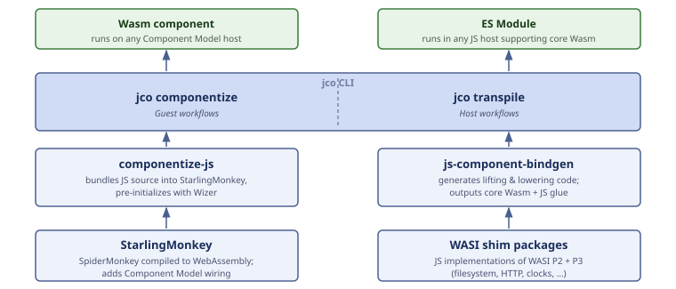
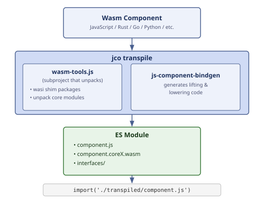

Jco ([`@bytecodealliance/jco` on NPM](https://www.npmjs.com/package/@bytecodealliance/jco))is a ["multi-tool for the JS WebAssembly ecosystem."](https://github.com/bytecodealliance/jco) At the 2026 Bytecode Alliance Plumbers Summit, Technical Steering Committee member Bailey Hayes put it another way: Jco is "like five projects in one."

It's certainly a project with many facets—five big ones, arguably! Recognizing what those facets are, and how they fit together, is the key to understanding why Jco matters beyond the JavaScript ecosystem. 

In this blog series, we'll draw on [Victor Adossi's Plumbers Summit presentation](https://github.com/bytecodealliance/meetings/blob/main/plumbers-summit/summit-feb26/slides/jco-and-browsers.pdf) to take an in-depth look at Jco from five different perspectives, in order to better grasp how you can use (and contribute to!) Jco today. There’s a lot to unpack here, so in this first post, we’ll try to get to grips with Jco as a layered architecture that brings together many pieces of the Wasm and JS ecosystem.

<!--end_excerpt-->

## 1. Wasm and JS ecosystem

To understand Jco, it helps to understand its layers.

## Building JS components

Here are the projects that are involved when using JavaScript to build new WebAssembly components:

### StarlingMonkey

At the base is [**StarlingMonkey**](https://github.com/bytecodealliance/StarlingMonkey): a JavaScript runtime built on SpiderMonkey (the same engine that powers Firefox) that compiles to WebAssembly. StarlingMonkey adds the Component Model wiring that SpiderMonkey itself doesn't include, handling the communication that occurs when a JS component calls an import or exposes an export.

### componentize-js

[**componentize-js**](https://github.com/bytecodealliance/ComponentizeJS)  takes your JavaScript source code and bundles it into StarlingMonkey to produce a proper WebAssembly component. 

Componentize-js runs the binary through [**Wizer**](https://github.com/bytecodealliance/wizer), a pre-initialization tool. At build time, Wizer executes the component's startup code (and your JS code at global scope) and snapshots the resulting state. The initialization cost is paid once, at build time, not on every instantiation.

Componentize-js is also in the process of being rewritten to use [`wit-dylib`](https://github.com/bytecodealliance/wasm-tools/tree/main/crates/wit-dylib) — a relatively new tool Alex Crichton added to `wasm-tools` that significantly simplifies the process of targeting the Component Model from an interpreted language. This rewrite will eliminate a somewhat circular dependency that currently exists in the build ([`js-component-bindgen`](https://crates.io/crates/js-component-bindgen), written in Rust, is currently consumed by componentize-js via transpilation, and is also depended on by componentize-js).

### The `jco` CLI

The **`jco` CLI** is the amalgamation of JS WebAssembly ecosystem tools into one user-facing layer. `jco componentize` calls down to `componentize-js`. But `jco`'s other major capability `jco transpile`operates differently.

### `jco` transpile

**`jco` transpile** ([`@bytecodealliance/jco-transpile` on NPM](https://www.npmjs.com/package/@bytecodealliance/jco-transpile) or via the `jco transpile` CLI) takes any WebAssembly component (written in any language: Rust, Go, Python, C, JavaScript, anything) and converts it into core Wasm modules plus JavaScript glue code that runs in Node.js or any browser with core Wasm support. No native Component Model support required. 

Under the hood, this involves "unbundling" the component—decomposing it into its constituent core Wasm modules with the imports and exports they need, then generating the glue code that implements Component Model semantics on top of those.

### js-component-bindgen

The Rust crate that makes this possible, [**`js-component-bindgen`**](https://github.com/bytecodealliance/jco/tree/main/crates/js-component-bindgen) ([`js-component-bindgen` on crates.io](https://crates.io/crates/js-component-bindgen)), handles the heavy lifting of generating correct "lifting and lowering" glue code for every Component Model type and intrinsic based on the WIT contract that you've specified for your component—that is to say, the translation layer that converts between Wasm's binary value representation (a string is a memory pointer plus a byte length) and idiomatic JavaScript types that your code works with.

### WASI P2 shims

Jco ships **WASI P2 shim packages**: JavaScript implementations of [WASI (the WebAssembly System Interface](https://github.com/WebAssembly/WASI), the standard set of I/O APIs for Wasm covering filesystem access, HTTP, clocks, randomness, and more) interfaces that let transpiled components call things like `wasi:http` and `wasi:io` from a browser or Node.js environment.

### WASI P3 shims

P3 shim support is in active development, with full WASI P3 support for Node.js environments imminent in Jco. Browser-side P3 shims are explicitly deferred until the Node.js shims stabilize.

## Looking ahead

In the next blog, we’ll take a look at four more ways of thinking about Jco, and break down how you can get involved. In the meantime, if you have questions or want to jump in right away, make sure to join the community on the [Bytecode Alliance Zulip `jco` channel](https://bytecodealliance.zulipchat.com/#narrow/stream/409526-jco).