<section class="cartoon">
    

        

# Announcing the Bytecode Alliance: Building a secure by default, composable future for WebAssembly

Today we announce the formation of the Bytecode Alliance, a new industry partnership coming together to forge WebAssembly's outside-the-browser future by collaborating on implementing standards and proposing new ones. Our founding members are Mozilla, Fastly, Intel, and Red Hat, and we're looking forward to welcoming many more.

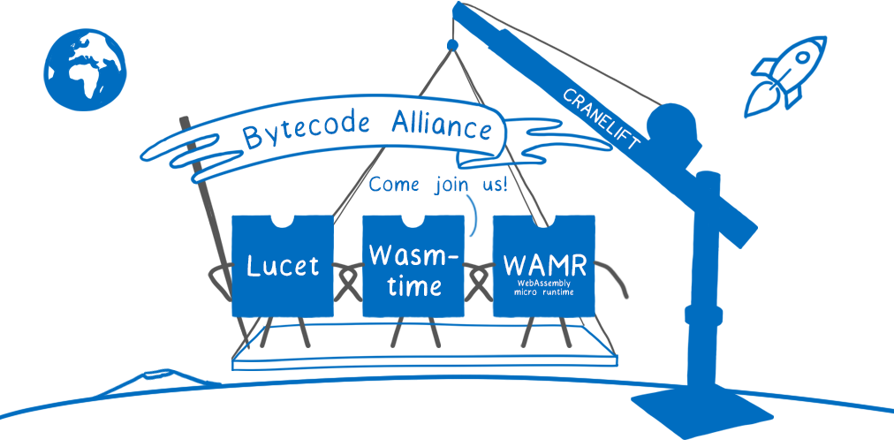

We have a vision of a WebAssembly ecosystem that is secure by default, fixing cracks in today's software foundations. And based on advances rapidly emerging in the WebAssembly community, we believe we can make this vision real.

We're already putting these solutions to work on real world problems, and those are [moving towards production](https://www.fastly.com/blog/join-the-beta-new-serverless-compute-environment-at-the-edge). But as an Alliance, we're aiming for something even bigger...

## Why

As an industry, we're putting our users at risk more and more every day. We're building massively modular applications, where 80% of the code base comes from package registries like npm, Pypy, and crates.io.

Making use of these flourishing ecosystems isn't bad. In fact, it's good! 

The problem is that current software architectures weren't built to make this safe, and bad guys are taking advantage of that... at a dramatically increasing rate.

What the bad guys are exploiting here is that we've gotten our users to trust us. When the user starts up your application, it's like the user's giving your code the keys to their house. They're saying "I trust you". 

But then you invite all of your dependencies, giving each one of them a full set of keys to the house. These dependencies are written by people who you don't know, and have no reason to trust.

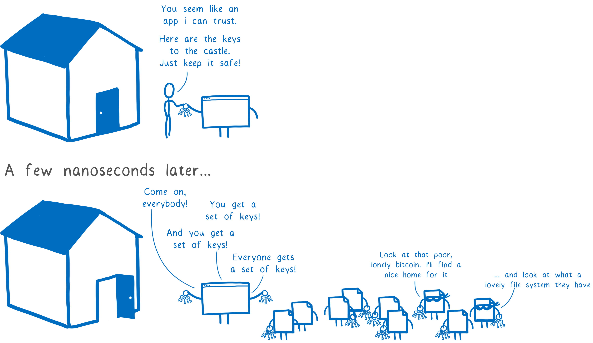

As a community, we have a choice. The WebAssembly ecosystem could provide a solution here... at least, if we choose to design it in a way that's secure by default. But if we don't, WebAssembly could make the problem even worse.

As the WebAssembly ecosystem grows, we need to solve this problem. And it's a problem that's too big to solve alone. That's where the Bytecode Alliance comes in.

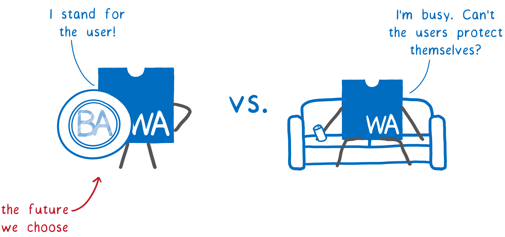

## What

The Bytecode Alliance is a group of companies and individuals, coming together to form an industry partnership. 

Together, we’re putting in solid, secure foundations that can make it safe to use untrusted code, no matter where you’re running it—whether on the cloud, natively on someone’s desktop, or even on a tiny IoT device.

With this, developers can be as productive as they are today, using open source in the same way, but without putting their users at risk.

This common, reusable set of foundations can be used on their own, or embedded in other libraries and applications.

Currently, we’re collaborating on:

### Runtimes:

- **[Wasmtime](https://github.com/bytecodealliance/wasmtime)** is a stand-alone WebAssembly runtime that can be used as a CLI tool or embedded into other systems. It's very configurable and scalable so that it can serve as the base for many use-case specific runtimes, from small IoT devices all the way up to cloud data centers.

- **[Lucet](https://github.com/bytecodealliance/lucet)** is an example of a use-case specific runtime. It's ideal for fast CDNs and Edge Compute, using AOT compilation and other techniques to provide low-latency and high-concurrency. We are refactoring it to use Wasmtime at its core.

- **[WebAssembly Micro Runtime (WAMR)](https://github.com/bytecodealliance/wasm-micro-runtime)** is another use-case specific runtime. It's ideal for small embedded devices that have extremely limited resources. It provides a small footprint and uses an interpreter to keep memory overhead low.

### Runtime components:

- **[Cranelift](https://github.com/bytecodealliance/Cranelift)** is emerging as a state-of-the-art code generator. It is designed to generate optimized machine code very quickly because it parallelizes compilation on a function-by-function level. 

- **[WASI common](https://github.com/bytecodealliance/wasmtime/tree/master/crates/wasi-common)** is a standalone implementation of the WebAssembly System Interface that runtimes can use. 

### Language tooling

- **[cargo-wasi](https://github.com/bytecodealliance/cargo-wasi)** is a lightweight Cargo subcommand that compiles Rust code to target WebAssembly and the WebAssembly System Interface for outside-the-browser use.

- **[wat](https://github.com/bytecodealliance/wat)** and **[wasmparser](https://github.com/bytecodealliance/wasmparser.rs)** parse WebAssembly. [wat](https://github.com/bytecodealliance/wat) parses the text format, and [wasmparser](https://github.com/bytecodealliance/wasmparser.rs) is an event-driven library for parsing the binary format.

And we expect this set of projects to expand as we grow the Alliance.

Our members are also leading the WASI standards effort itself, as well as the Rust to WebAssembly working group. 

## Who

The founding members of the Bytecode Alliance are Mozilla, Fastly, Intel, and Red Hat. 

We're starting with a lightweight governance structure. We intend to formalize this structure gradually over time. You can read more about this our [FAQ](https://bytecodealliance.org/#faq).

As we said before, this is too big to go it alone. That's why we're happy to welcome new members to the Alliance. If you want to join, please email us at [hello@bytecodealliance.org](mailto:hello@bytecodealliance.org). 

Here's why we think this is important:

<blockquote>
  
WebAssembly is changing the web, but we believe WebAssembly can play an even bigger role in the software ecosystem as it continues to expand beyond browsers. This is a unique moment in time at the dawn of a new technology, where we have the opportunity to fix what’s broken and build new, secure-by-default foundations for native development that are portable and scalable. But we need to take deliberate, cross-industry action to ensure this happens in the right way. Together with our partners in the Bytecode Alliance, Mozilla is building these new secure foundations—for everything from small, embedded devices to large, computing clouds.

  <cite>— Luke Wagner, Distinguished Engineer at Mozilla and co-creator of WebAssembly</cite>
</blockquote>

<blockquote>

Fastly is very happy to help bring the Bytecode Alliance to the community. Lucet and Cranelift have been developed together for years, and we’re excited to formalize their relationship and help them grow faster together. This is an important moment in computing history, marking our chance to redefine how software will be built across clients, origins, and the edge. The Bytecode Alliance is our way of contributing to and working with the community, to create the foundations that the future of the internet will be built on.

<cite>
— Tyler McMullen, CTO at Fastly
</cite>
</blockquote>

<blockquote>
  
“Intel is joining the Bytecode Alliance as a founding member to help extend WebAssembly’s performance and security benefits beyond the browser to a wide range of applications and servers. Bytecode Alliance technologies can help developers extend software using a wide selection of languages, building upon the full capabilities of leading-edge compute platforms”

  <cite>— Mark Skarpness; VP, Intel Architecture, Graphics, and Software; Director, Data-Centric System Stacks</cite>
</blockquote>

<blockquote>
  
Red Hat believes deeply in the role open source technologies play in helping provide the foundation for computing from the operating system to the browser to the open hybrid cloud. Wasmtime is an exciting development that helps move WebAssembly out of the browser into the server space where we are experimenting with it to change the trust model for applications, and we are happy to be involved in helping it grow into a mature, community-based project.

  <cite>— Chris Wright, senior vice president and Chief Technology Officer at Red Hat</cite>
</blockquote>

So that's the big news! 🎉 

To learn more about what we're building together, read on.

## The problem

The way that we architect software has radically changed over the past 20 years. In 2003, companies had a hard time getting developers to reuse code. 

Now 80% of your average code base is built with modules downloaded from registries like JavaScript's npm, Python's Pypy, Rust's crates.io, and others. Even C++ is moving towards enabling an ecosystem of composable modules.

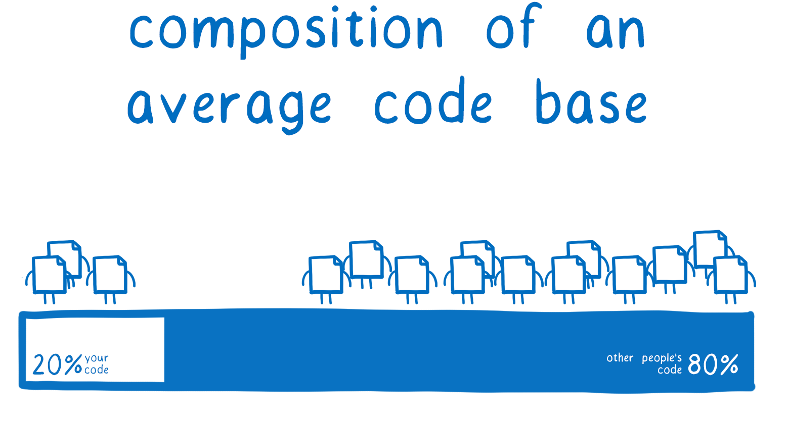

This new way of developing applications has made us much more productive as an industry. But it has also introduced gaping wide holes in our security. And as I talked about above, the bad guys are using those holes to attack our users.

The user is entrusting us with the keys to their house and we're giving that access away like candy... and that's not because we're irresponsible. It's because there's huge value in these packages, but no easy way to mitigate the security risks that come from using them.

More than this, it's not just our own dependencies that come along for the ride. It's also any modules that they depend on—the indirect dependencies.

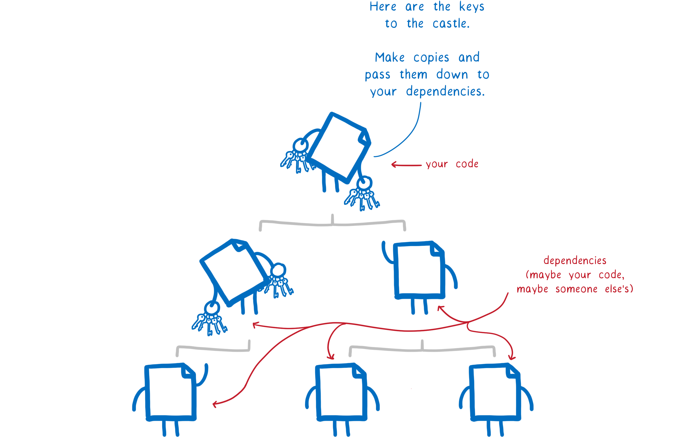

What do these developers get access to?

1. resources on the machine—things like files and memory
2. APIs and syscalls—tools that they can use to do things to those resources

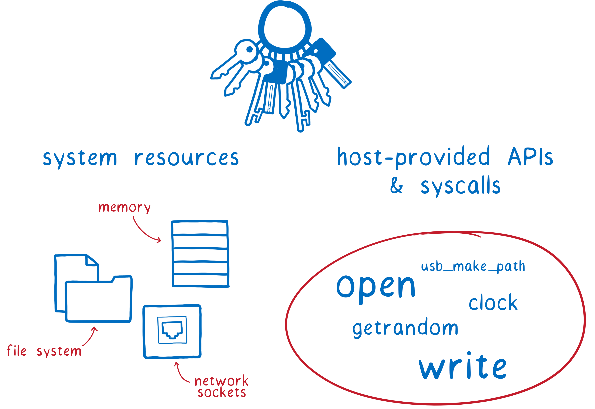

This means that these modules can do a lot of damage. This could either be on purpose, as with malicious code, or completely accidentally, as with vulnerable code.

Let's look at how these attacks work.

### Malicious code

Malicious code is written by the attacker themselves. 

Attackers often use social engineering to get their package into applications. They create a package that has useful features, and then sneak in some malicious code. Once the code is in the app and the user starts up the app, the code can attack the user. 

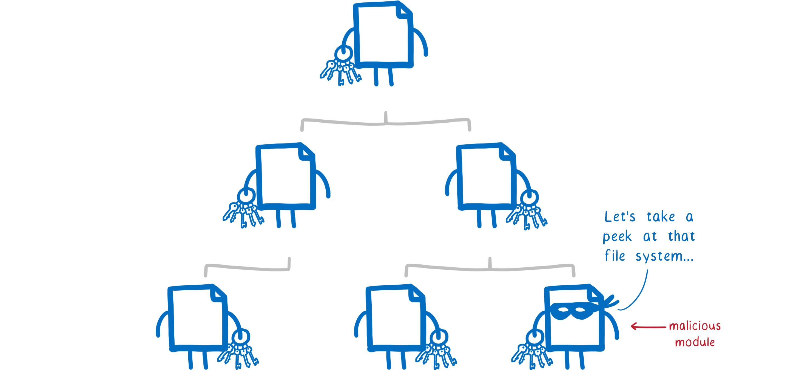

This is how a hacker [stole $1.5 million worth](https://komodoplatform.com/update-agama-vulnerability/) of cryptocurrency (and almost $13 million more) from users, [starting in March](https://snyk.io/blog/yet-another-malicious-package-found-in-npm-targeting-cryptocurrency-wallets/) of this year. 

- Day 0 (March 6): The attacker published a module to npm: electron-native-notify. This seemed useful—it helped Electron apps fire off native notifications in a way that worked across platforms. It didn't have any malicious code in it, yet. 
- Day 2: To pull of the heist, the attacker has to get this module into the cryptocurrency app. The vector they choose is a dependency in an application that helps users manage their cryptocurrency, the Agama Wallet.
- Day 17: The attacker adds the malicious payload.
- Day 41-66: The app is rebuilt, pulling in the most recent version of the dependency, and electron-native-notify with it. At this point, it starts sending user's "seeds" (username/password combos) to a server. The attacker can then use these seeds to empty users' wallets. 
- Day 90: A user alerts npm to suspicious behavior in electron-native-notify, and they notify the cryptocurrency platform, which moved funds from vulnerable wallets to a secure one.

Let's look at what access this malicious code needed to pull off the attack.

It needed the seed. To do this, it got access to memory holding the seed.

Then it needed to send the seed to a server. For this it needed access to a socket, and access to an API or syscall for opening that socket.

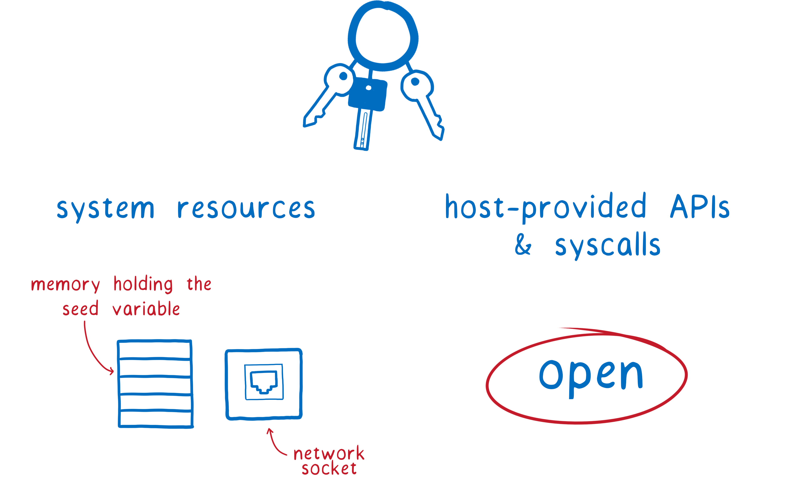

Malicious code attacks are on the rise as more and more attackers realize how vulnerable our systems of trust are. For example, the number of malicious modules published to npm more than doubled from 2017 to 2019. And Adam Baldwin, npm's VP of Security, points out that [these attacks are getting more serious](https://www.brighttalk.com/webcast/17595/361635/javascript-supply-chain-security).

<blockquote>
In 2019, we're seeing more financially motivated attacks. Early attacks were focused on shenanigans—deleting files and trying to steal some credentials. Real basic attacks, kind of smash and grab style. Now end users are the target. And [the attackers] are trying hard to be patient, to be sneaky, to really have a well planned out attack.
<cite>— Adam Baldwin, VP of Security at npm</cite>
</blockquote>

### Vulnerable code

Vulnerabilities are different. The module maintainer isn't trying to do anything bad. 

The module maintainer just has a bug in their code. But attackers can use that bug to trick their code into doing something that shouldn't do.

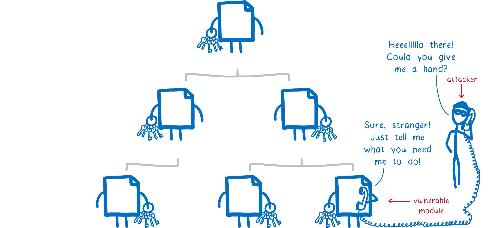

For an example of this, let's look at ZipSlip.

ZipSlip is a vulnerability found in modules in many ecosystems: JavaScript, Java, .NET, Go,Ruby, C++, Python... the list goes on. And it affected thousands of projects, including ones from HP, Amazon, Apache, Pivotal, and many more.

If a module had this vulnerability, attackers could use it to replace files anywhere in the file system. For example, the attacker could use it to replace .js files in the node_modules directory. Then, when the .js file was required, the attacker's code would run. 

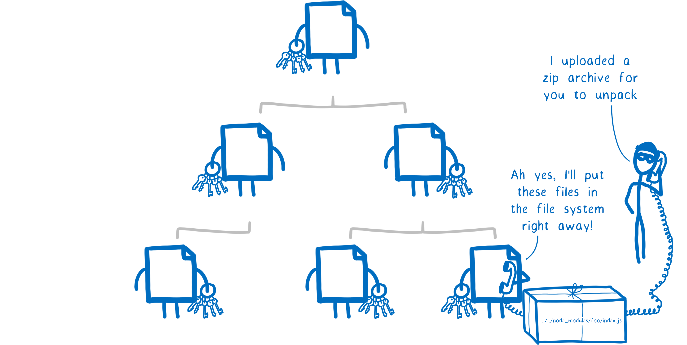

So how did this work? 

The attacker would create a file, and give it a filename that included '../', building up a relative file path. When the vulnerable code unzipped it, it wouldn't sanitize the filename. So it would call the `write` syscall with the relative path, placing the file wherever the attacker wanted it to go in the file system.

So what access did the vulnerable code need for the attacker to pull this off?

It needed access to the directory with the sensitive files.

It also needed access to the `write` syscall.

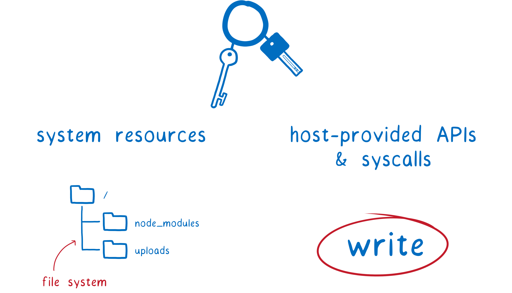

Vulnerabilities are on the rise, as well, with an 88% increase in the last two years, as Snyk reported in their [2019 State of Open Source Security Report](https://snyk.io/opensourcesecurity-2019/). And many popular ecosystems are affected:

<blockquote>In 2018, vulnerabilities for npm grew by 47%. Maven Central and PHP Packagist disclosures grew by 27% and 56% respectively.
<cite>— Snyk 2019 State of Open Source Security Report</cite>
</blockquote>

With these risks, you would think that patching vulnerabilities would be a high priority. But as Snyk found, only 59% of packages have known fixes for disclosed vulnerabilities, because many maintainers don't have the time or the security know-how to fix these vulnerabilities.

This leads to widespread vulnerability, as these vulnerable modules are depended on by other modules. For example, a [study of npm modules](https://arxiv.org/abs/1902.09217) found that up to 40% of packages depend on code with at least one publicly known vulnerability.

## How can we protect users today?

So how can you protect your users against these threats in today's software ecosystem? 

- You can run scanners that detect fishy coding patterns in your code and that of your dependencies. But there are many things these automated tools can't catch.

- You could subscribe to a monitoring service that alerts you when a vulnerability is found one of your dependencies. But this only works for those that have been found. And even once a vulnerability has been found, there's a good chance the maintainer won't be able to fix it quickly. For example, [Snyk found](https://snyk.io/opensourcesecurity-2019/) in the npm ecosystem that for the top 6 packages, the median time-to-fix (measured starting at the vulnerability's inclusion) was 2.5 years.

- You could try and do manual code review. Whenever there's an update in a dependency, you'd review the changed lines. But if you have hundreds of modules in your dependency tree, that could easily be [100,000 lines of code](https://arxiv.org/abs/1902.09217) to review every few weeks.

- You could pin your dependencies, so that malicious code can't get in until you've had a chance to review. But then fixes for vulnerabilities would be stalled, leaving your app vulnerable longer.

This all makes for a kind of no-win scenario, which makes you want to throw up your hands and just hope for the best. But as an industry, we simply can't do that. There's too much at stake for our users.

All of these solutions try to catch malicious and vulnerable code. But what if we look at this a different way? 

Part of the problem was the *access* that these modules had. What if we took away that access?

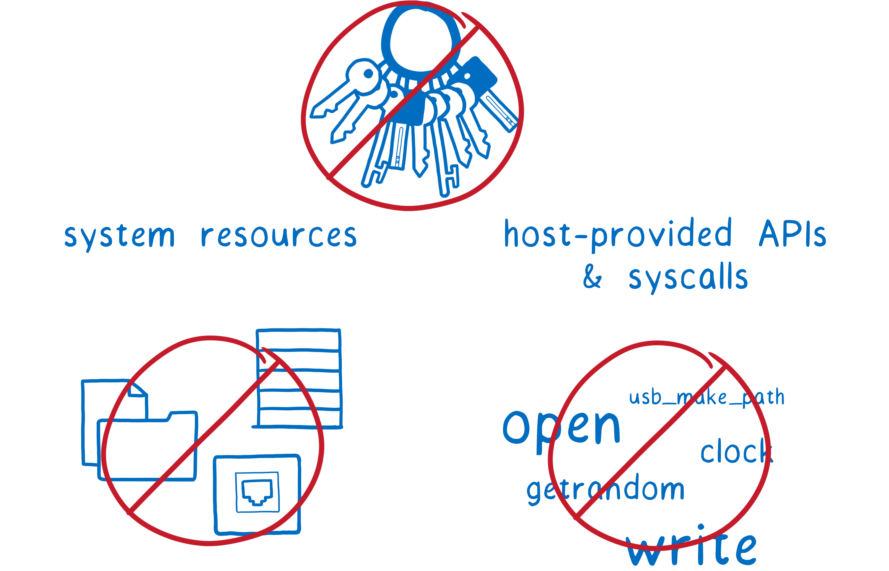

We've faced this kind of challenge as an industry before... just at a different granularity.

When you have two programs running on a computer at the same time, how do you know that one won't mess with the other? Do you have to trust the programs to behave?

No, because protection is built into the operating system. The tool that OSs use to protect programs from each other is the process.

When you start a program, the OS fires up a new process. Each process gets its own chunk of memory to use, and it can't access memory in other processes. 

If it wants to get data from the other process, it has to ask. Then the data is sent across the process boundary. This makes sure each program is in control of its own data in memory. 

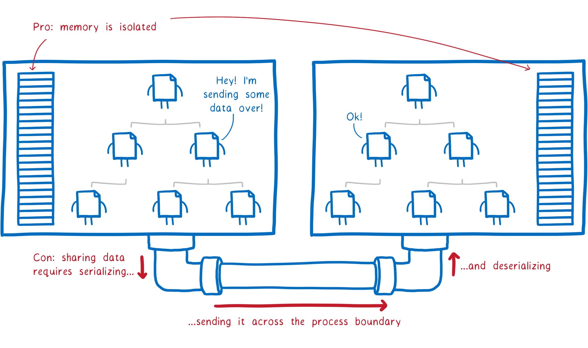

This memory isolation does make it much safer to run two programs at the same time. But this isn't perfect security. A malicious program can still mess with certain other resources, like files in the file system. 

VMs and containers were developed to fix this. They ensure that something running in one VM or container can't access the file system of another. And with sandboxing, it's possible to take away access to APIs and syscalls.

So could we put each package in its own little isolated unit? Its own little sandboxed process?

That would solve our problem. But it would also introduce a new problem. 

All of these techniques are relatively heavyweight. If we wrap hundreds of packages into their own sandboxed process, we'd quickly run out of memory. We'd also make the function calls between the different packages much slower and more complicated.

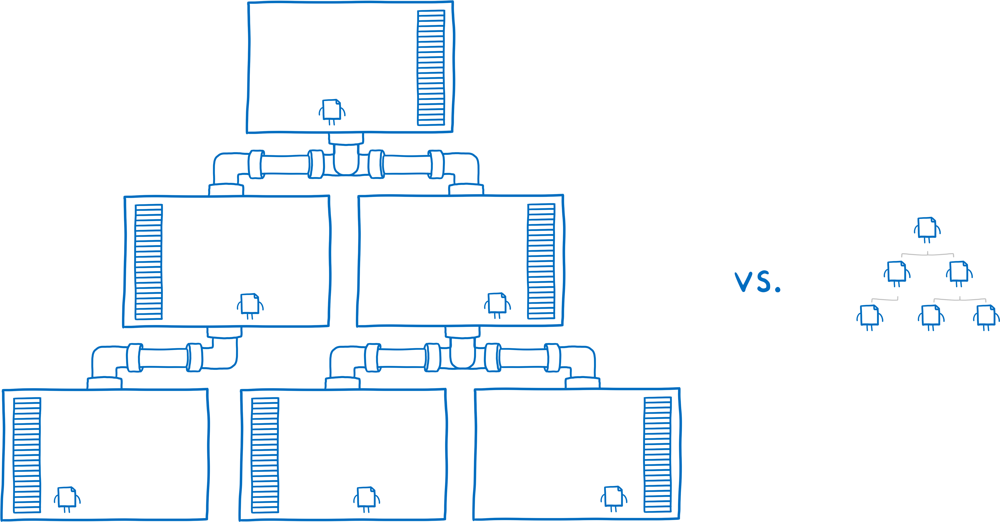

But it turns out that new technologies are giving us new options. 

As we're building out the WebAssembly ecosystem, we can design how the pieces fit together in a way that gives you the kind of isolation that you get with processes or containers, but without the downsides. 

## Tomorrow's solution: WebAssembly "nanoprocesses"

WebAssembly can provide the kind of isolation that makes it safe to run untrusted code. We can have an architecture that's like Unix's many small processes, or like containers and microservices.

But this isolation is much lighter weight, and the communication between them isn't much slower than a regular function call. 

This means you can use them to wrap a single WebAssembly module instance, or a small collection of module instances that want to share things like memory among themselves.

Plus, you don't have to give up the nice programming language affordances—like function signatures and static type checking. 

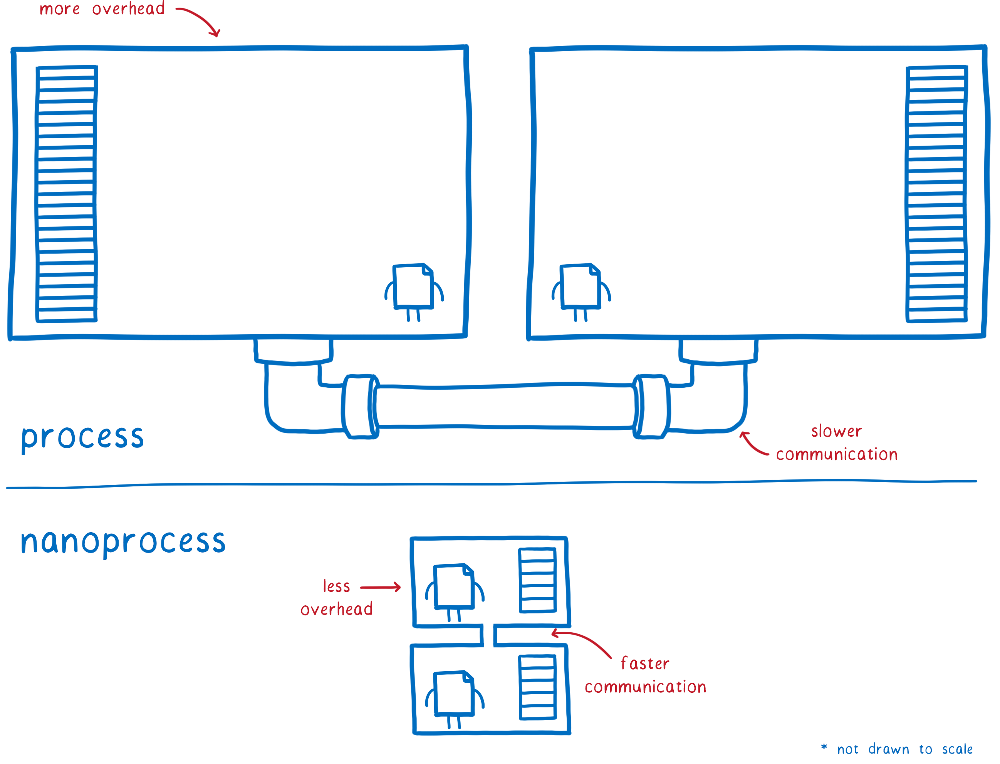

So how does this work? What about WebAssembly makes this possible? 

First, there's the fact that each WebAssembly module is sandboxed by default.

By default, the module doesn't have access to APIs and system calls. If you want the module to be able to interact with anything outside of the module, you have to explicitly provide the module with the function or syscall. Then the module can call it. 

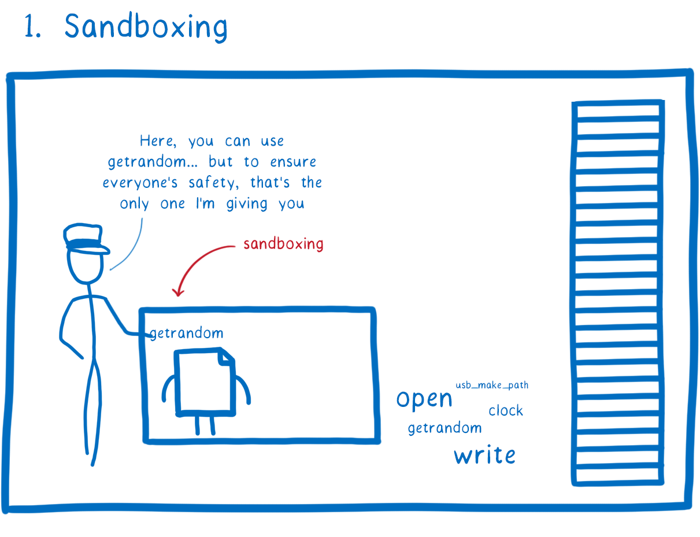

Second, there's the memory model. 

Unlike a normal binary compiled directly to something like x86, a WebAssembly module doesn't have access to all of the memory in its process. It only has access to the chunk of memory that has been assigned to it. 

In theory, scripting languages would also provide this kind of isolation. Code in scripting languages can't directly access the memory in the process. It can only access memory through the variables it has in scope. 

But in most scripting language ecosystems, code makes a lot of use of a shared global object. That's effectively the same as shared memory. So the conventions in the ecosystem make memory isolation a problem for scripting languages as well.

WebAssembly could have had this problem. In the early days, some wanted to establish a convention of passing a shared memory in to every module. But the community group opted for the more secure convention of keeping memory encapsulated by default.

This gives us memory isolation between the two modules. That means that a malicious module can't mess with the memory of its parent module.

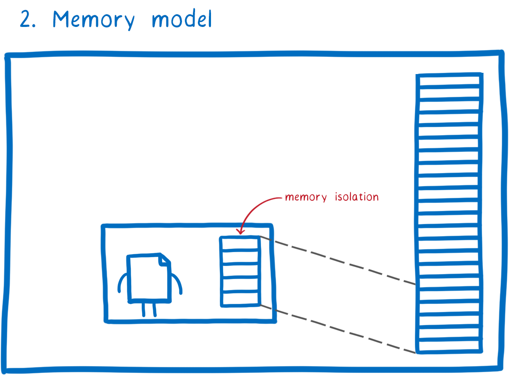

But how do we share data from our module? You have to pass it in or out as the values of a function call. 

There's a problem here, though. By default, WebAssembly only has a handful of numeric types, which means you can only pass single digits across. 

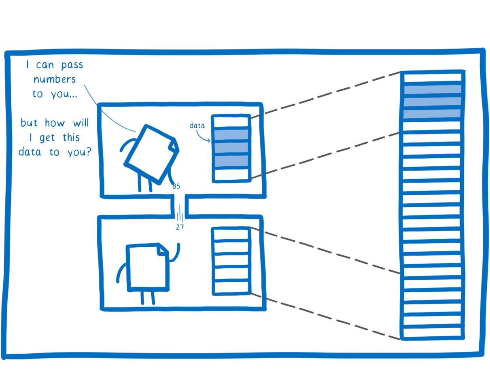

Here's where the third feature comes in—the [interface type proposal](https://hacks.mozilla.org/2019/08/webassembly-interface-types/) which we demoed in August. With interface types, modules can communicate using more complex values—things like like strings, sequences, records, variants, and nested combinations of these. 

That makes it easy for two modules to exchange data, but in a way that's secure and fast. The WebAssembly engine can do direct copies between the caller and the callee's memories, without having to serialize and deserialize the data. And this works even if the two modules aren't compiled from the same language. 

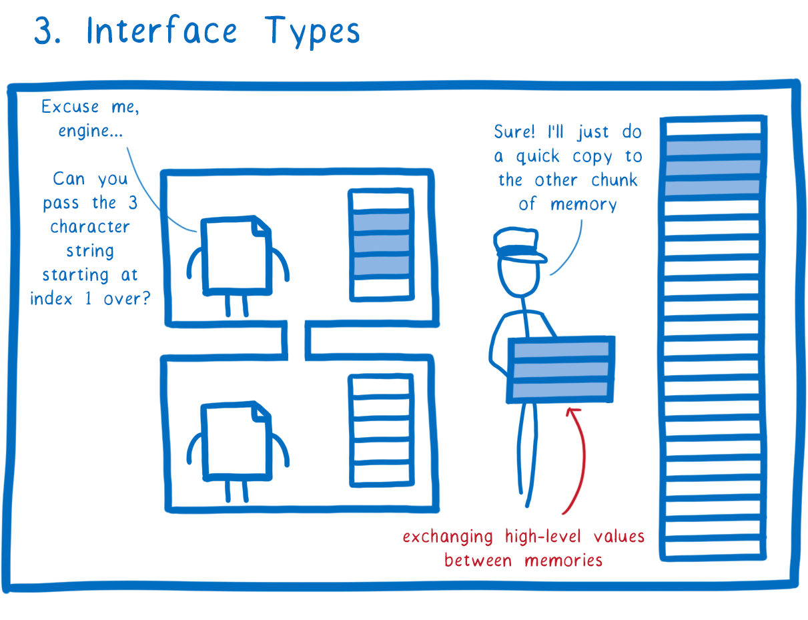

So that's how we ensure that a malicious module can't mess with the memory of other modules in the application. 

But we don't just need to take precautions around how memory is handled between these modules. Because if the application is actually going to be able to do anything with that data, it is going to need to call APIs or system calls. And those APIs or system calls might have access to shared resources, like the file system. And as we talked about in a [previous post](https://hacks.mozilla.org/2019/03/standardizing-wasi-a-webassembly-system-interface/), the way that most operating systems handle access to the file system really falls down in providing the security we need here. 

So we need APIs and system calls that actually have the concept of permissions baked into them, so that they can give different modules different permissions to different resources.

This is where the fourth feature comes in: [WASI, the WebAssembly system interface](https://hacks.mozilla.org/2019/03/standardizing-wasi-a-webassembly-system-interface/). 

That gives us a way to isolate these different modules from each other and give them fine-grained permissions to particular parts of the file system and other resources, and also fine grained permissions for different system calls.

So with this, we've taken control of the keys.

What's missing?

Right now, we don't have a way to pass these keys down through the dependency tree. We need a way for parent modules to give these keys to their dependencies. This way, they can give their dependencies exactly the keys they need and no other ones. And then, those dependencies can do the same thing for their children, all the way down through the tree.

That's what we'll be working on next. In technical terms, we're planning to use a fine grained form of per-module virtualization. This is an idea that researchers [have demonstrated in research contexts](http://www.cs.cmu.edu/~aldrich/papers/ecoop17modules.pdf), and we're working on bringing this to WebAssembly.

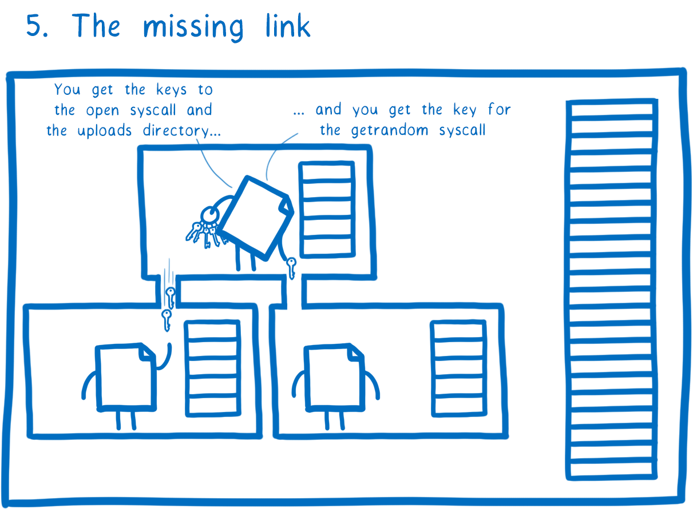

Taken all together, these features make it possible for us to have similar isolation to that of a process, but with much lower overhead. This pattern of usage is what we're calling a WebAssembly nanoprocess. 

It's still just WebAssembly, but it follows a particular pattern. And if we build this pattern into the tools and conventions we use, we can make third-party code reuse safe in WebAssembly in a way it hasn't been in other ecosystems to date. 

*Sidenote: At the moment, every nanoprocess is made up of exactly one wasm module. In the future, we'll focus on toolchain support for creating nanoprocesses containing multiple wasm modules, allowing native-style dynamic linking while preserving the memory isolation of nanoprocesses*

With these foundations in place, developers will be able to build dependency trees of isolated packages, each with their own tiny little nanoprocess around them.

## How do nanoprocesses protect users?

So how does this help us keep users safe? 

In both of these cases, it's the fact that we're following the [principle of least authority](https://medium.com/agoric/pola-would-have-prevented-the-event-stream-incident-45653ecbda99) that's keeping us secure. Let's walk through how this helps.

### Malicious code

In order to carry out an attack, a module often needs access to resources and APIs that it wouldn't otherwise need access to. With our approach, the module has to declare that it needs access to these things. That makes it easy to see when it's asking to do things it shouldn't.

For example, the wallet stealing module needed access to both a socket pointing to the server that it was sending the seed to, and the ability to open a network connection. 

But this module was just supposed to take the text that was passed in to it and hand it off to the system, so that the system could display it. Why would the module need to open a network connection to a remote server to do that?

If electron-native-notify had asked for these permissions from the start, that would've been a serious red flag. The maintainers of EasyDEX-GUI probably wouldn't have accepted it into their dependency tree.

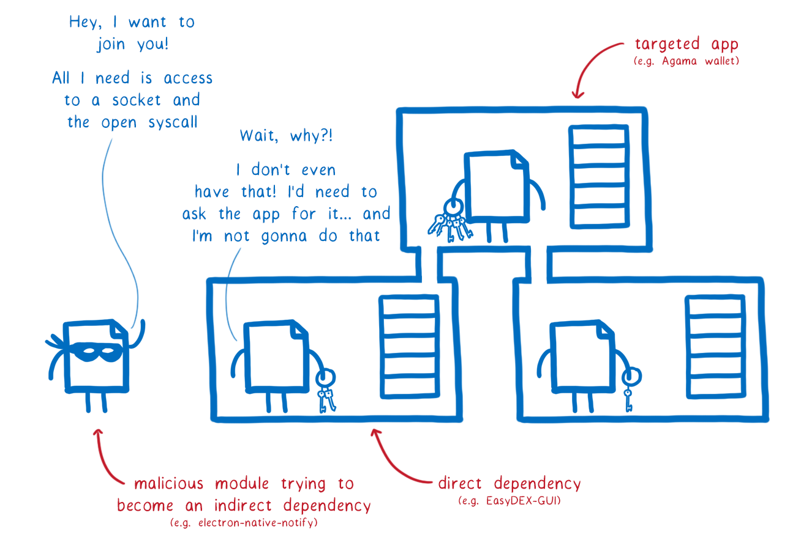

If the malicious maintainer had tried to slip these access requests in later, sometime after it was already in EasyDEX-GUI, then that would've been a breaking change. The module's signature would have changed, and WebAssembly throws an error when the calling code doesn't provide the imports or parameters that a module expects.

This means there's no way to sneak in acess to a new resource or system call under the radar.

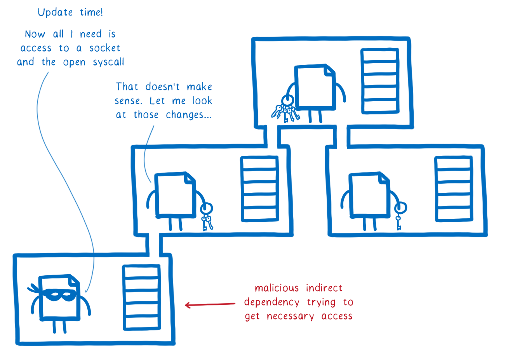

So it's unlikely that the maintainer could get the basic access they needed to communicate with the server. But even if this maintainer were somehow able to trick the app developer into granting them this access, they still would have an extremely hard time getting the seed. 

That's because the seed would be in another module's memory. There are two ways for a module to get access to something from some other module's memory. And neither of them allow the malicious module to be sneaky about it.

1. The module that has the seed exports the seed variable, making it automatically visible to all other modules in the app.
2. The module that has the seed passes it directly to a function in the malicious module as a parameter.

Both seem incredibly unlikely for a variable this sensitive.

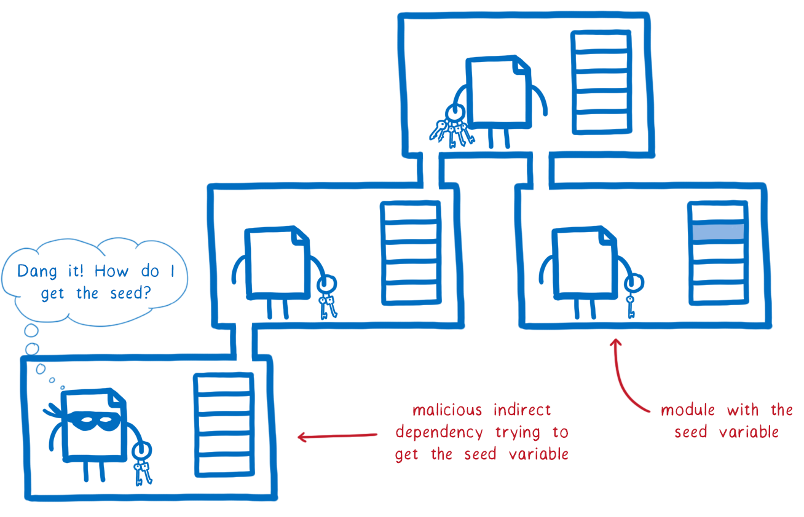

There is unfortunately one less straightforward way that attackers can access another module's memory—side-channel attacks like Spectre. OS processes attempt to provide something called time protection, and this helps protect against these attacks. Unfortunately, CPUs and OSes don't offer finer-than-process granularity time protection features. 

There's a good chance you've never thought about using processes to protect your code. Why don’t most people have to care? Because hosting providers take care of it, sometimes using complex techniques.

If you are architecting your code with isolated process now, you may still need to. Making a shift to nanoprocesses here would take careful analysis.

But there are lots of situations where timing protection isn’t needed, or where people aren't using processes at all right now. These are good candidates for nanoprocesses.

Plus, as CPUs evolve to provide cheaper time protection features, WebAssembly nanoprocesses will be in a good position to quickly take advantage of these features, at which point you won't need to use OS processes for this.

### Vulnerable code

How does this protect against attackers exploiting vulnerabilities? 

Just as with malicious modules, it's less likely that a vulnerable module legitimately needs the combination of access rights that the attacker needs. 

In our ZipSlip example, even for legitimate uses, the vulnerable module does need access to a dangerous syscall—the `write` syscall which allows it to write files.

But it doesn't need access to the `node_modules` directory for any legitimate use. It would only have access to the directory that its parent passes to it, which would be some directory that zip files can be unarchived into.

That makes it impossible for the vulnerable module to carry out the attackers wishes (unless the parent knowingly passes a very sensitive directory into to the vulnerable module).

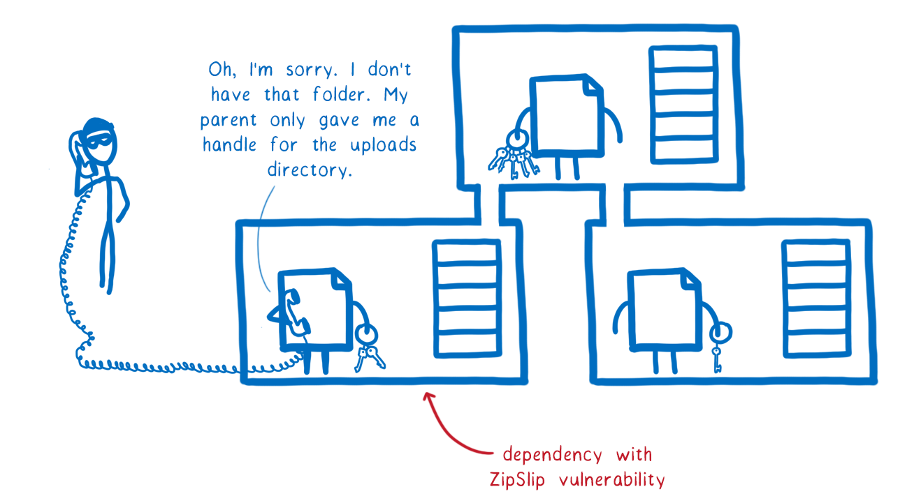

As noted in the caveat above, it is possible that the application developer would pass in a sensitive directory, like the root directory. But for this to work, this mistake would have to be made in the top level package. It can't happen in a transitive dependency. By making all of these accesses explict, it makes it much easier to catch those kinds of sloppy mistakes in review.

## Other benefits of nanoprocesses

With nanoprocesses, we can continue to build massively modular applications... we can keep the developer productivity gains while also ensuring that our users are safe.

But what else can nanoprocesses help with?

### Isolation that fits anywhere

These nanoprocesses—these little container-like things—can fit in all sorts of places that regular processes and containers and VMs can't go. 

This is what makes it possible for us to wrap each package or groups of packages into these tiny little micro processes. Because they're so small, they won't blow up the size of your application. But dependency trees aren't the only places where you would use these nanoprocesses. 

Here are just a couple of other use cases we see for them, and which partners in the Alliance are working on:

#### Handling requests for tens of thousands of customers on the same machine

Fastly serves 13% of the Internet's traffic. That means responding to millions of requests, and trying to do it with as little overhead as possible while keeping customers secure. 

They've come up with an innovative architecture using WebAssembly nanoprocesses which makes it possible to [securely host tens of thousands of simultaneously running programs](https://vimeo.com/showcase/5437560/video/291584445) in the same process. Their approach completely isolates the request from previous requests, ensuring full VM isolation. It has the added advantage of having cold start that's orders of magnitude faster.

#### Software fault isolation for individual libraries in native applications

In some applications, most of your code is written in-house, and only a few libraries are written by untrusted developers outside of the organization.

In these cases, you can use a nanoprocess to create a lightweight, in-process sandbox for a single library, rather than having your full dependency tree wrapped in nanoprocesses.

We've started building this kind of [sandboxing in Firefox](https://bugzilla.mozilla.org/show_bug.cgi?id=1562797) to protect users from bugs in third party libraries, like font rendering engines, and image and audio decoders.

### Improved software composability

For decades, software development best practices have been driving towards more and more componentized architectures, built out of small, Lego-like pieces. 

This started with libraries and modules described above, running in the same process in the same language. More recently, there's been a progression towards services, and then microservices, which give you the security benefits of isolation. 

But beyond security, the isolation services provide also makes software more composable. It means that you can plug together services that are written in different languages, or different versions of the same language. That gives you a  much larger set of lego blocks to play with.

But these services can't go all the places that libraries can go because they're too big. They are often running inside a process, which is running inside of a container, which is running on a server. This means that you often have to use a coarse-grained approach when breaking your app apart into these services.

With wasm, we can replace microservices with nanoprocesses and get the same security and language independence benefits. It gives us the composability of microservices without the weight. This means we can use a microservices-style architecture and the language interoperability that provides, but with a finer-grained approach to defining the component services.

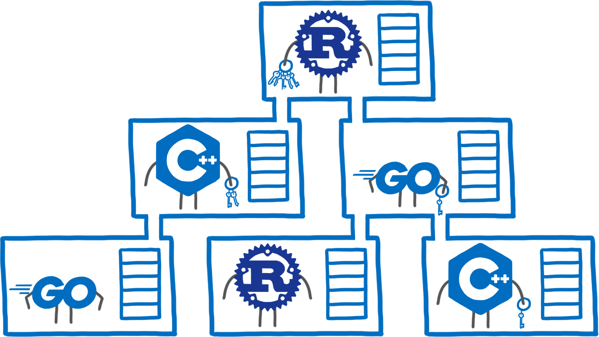

## Join us

So that's the vision we have for a safer future for our users. We believe that WebAssembly doesn't just have the opportunity but the responsibility to provide this kind of safety. 

And we hope that you'll join us!

</section>
