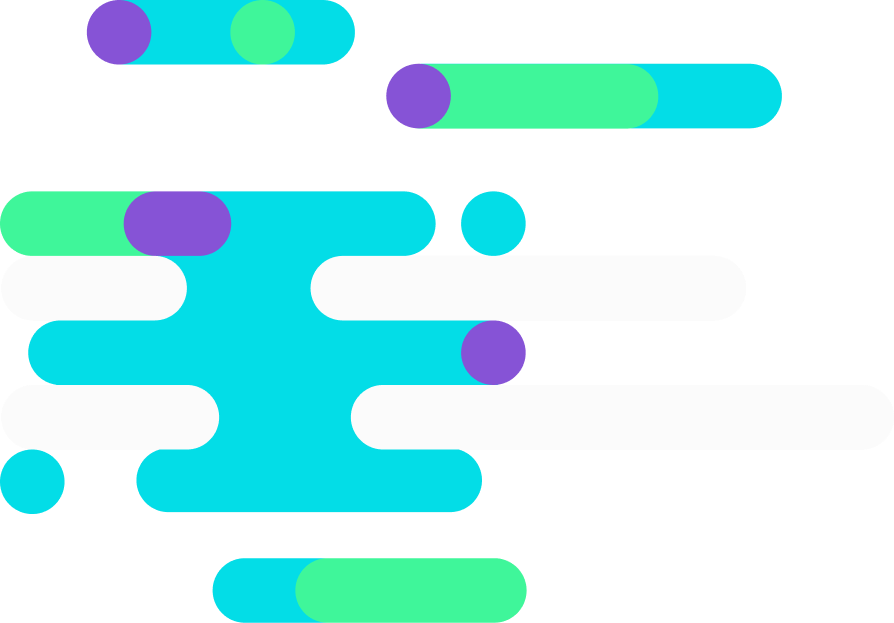
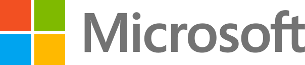

<header id="hero" class="section-hero">
    

</header>

<section>
    

        

## About the Bytecode Alliance

The Bytecode Alliance is a nonprofit organization dedicated to creating secure new software foundations, building on standards such as [WebAssembly](https://webassembly.org/) and [WebAssembly System Interface (WASI)](https://wasi.dev).

The Bytecode Alliance is committed to establishing a capable, secure platform that allows application developers and service providers to confidently run untrusted code, on any infrastructure, for any operating system or device, leveraging decades of experience doing so inside web browsers.

We have a [vision]({{ site.baseurl }}/articles/announcing-the-bytecode-alliance) for a secure-by-default WebAssembly ecosystem for all platforms.

</section>

<section class="section section-tinted">
    

        

            

            

            

## Become a member

The Bytecode Alliance welcomes contributions and participation from across the industry. Join as a member and help drive the future of computing.

<a href="{{ site.baseurl }}/membership">Join Now</a>

</section>

<section>
    

        

## Members

</section>

<section id="faq">
    

        

            

                <a href="#faq"><h4>FAQ</h4></a>
                <h2>Frequently Asked Questions</h2>
            

            <ul id="faq-entries">
            <li class="fentry" id="what-is-the-bytecode-alliance">
                <a href="#what-is-the-bytecode-alliance"><h3>What is the Bytecode Alliance?</h3></a>
                <input type="checkbox">
                

                    

                    

                    
                

                

                    
The Bytecode Alliance is a nonprofit organization working to provide state-of-the-art foundations
                        for the development of runtime environments and language toolchains where security, efficiency,
                        and modularity can all coexist across a wide range of devices and architectures. We enable
                        innovation in compilers, runtimes, and tooling, focusing on fine-grained sandboxing,
                        capabilities-based security, modularity, and standards such as WebAssembly and WASI.

                

            </li>
            <li class="fentry" id="why-is-this-important-now">
                <a href="#why-is-this-important-now"><h3>Why is this an important focus right now?</h3></a>
                <input type="checkbox">
                

                    

                    

                    
                

                

                
Developers are running untrusted code in many new places, from the cloud to IoT devices. But
                    this opens up many security concerns, and also portability challenges when you try to run
                    the same code across these different systems. We don’t yet have a solid foundation to build
                    upon.
                

                

                    With WebAssembly and emerging related standards such as WASI, WebAssembly Interface
                    Types, and Module Linking, this solid foundation is taking shape. By building this foundation,
                    we can address some persistent fundamental issues of today’s software development practices.
                

                

            </li>
            <li class="fentry" id="why-a-cross-industry-effort">
                <a href="#why-a-cross-industry-effort"><h3>Why does this require a cross-industry effort?</h3></a>
                <input type="checkbox">
                

                    

                    

                    
                

                

                
The problem we are attempting to solve is fundamentally a cross-industry problem. We want to
                    allow for safe interaction and code reuse across server, edge, browser, mobile, and more
                    platforms. These different platforms are developed by different groups across the industry.
                    Our intent is to bring them together to solve problems for everyone.

                

            </li>
            <li class="fentry" id="relation-to-standards-bodies">
                <a href="#relation-to-standards-bodies"><h3>How does this relate to standardization bodies like the W3C’s WebAssembly CG?</h3></a>
                <input type="checkbox">
                

                    

                    

                    
                

                

                
The Bytecode Alliance is focused on creating a shared implementation of standards produced by
                    the WebAssembly CG and other standardization bodies.
                

                

                    We believe that standards are best informed by implementation. To enable this, we bring
                    together a wide range of different use cases. Many of our contributors are also active in
                    standardization and use this implementation experience and feedback to inform their work.
                

                

            </li>
            <li class="fentry" id="projects-of-the-alliance">
                <a href="#projects-of-the-alliance"><h3>What projects are already a part of this?</h3></a>
                <input type="checkbox">
                

                    

                    

                    
                

                

                <h4>Wasmtime</h4>
                

                    <a href="https://github.com/bytecodealliance/wasmtime">Wasmtime</a> is a WebAssembly runtime. It runs WebAssembly outside of the browser, in a fast,
                    portable, secure, and scalable way.
                

                

                    Wasmtime serves as the base layer for other hosts. For example, Fastly is refactoring the
                    Lucet runtime on top of Wasmtime, and Red Hat is building a WebAssembly runtime based on
                    Wasmtime for the Enarx project (part of the Confidential Computing Consortium).
                

                <h4>Cranelift</h4>
                

                    <a href="https://github.com/bytecodealliance/wasmtime/tree/main/cranelift">Cranelift</a> is a highly optimized code generator, focused on fast compilation. It’s used in
                    Wasmtime for both JIT and AOT compilation, and is currently being integrated into Firefox as
                    the optimizing compiler for WebAssembly. It’s also used as an experimental backend for the
                    Rust compiler.
                

                <h4>Lucet</h4>
                

                    <a href="https://github.com/bytecodealliance/lucet">Lucet</a> is an AOT compiler utilizing Cranelift. It is meant specifically for low-latency,
                    high-concurrency server-based applications of WebAssembly.
                

                <h4>WebAssembly Micro-Runtime (WAMR)</h4>
                

                    <a href="https://github.com/bytecodealliance/wasm-micro-runtime">WAMR</a> is an interpreter based WebAssembly runtime, optimized for embedded and
                    resource-constrained devices.
                

                <h4>Enarx (affiliated)</h4>
                

                    <a href="https://enarx.io">Enarx</a> is an application deployment system enabling applications to run within Trusted Execution Environments (TEEs) in a platform independent way. It's a project of the <a href="https://confidentialcomputing.io/">Confidential Computing Consortium</a> that is based on Wasmtime and closely affiliated with the Bytecode Alliance.
                

                

            </li>
            <li class="fentry" id="project-licenses">
                <a href="#project-licenses"><h3>How are these projects licensed?</h3></a>
                <input type="checkbox">
                

                    

                    

                    
                

                

                
The main projects are licensed under the Apache 2.0 license + LLVM exception (which ensures GPL compatibility). Some supporting projects are licensed under Apache 2.0/MIT dual license.

                

            </li>
            <li class="fentry" id="how-to-get-involved">
                <a href="#how-to-get-involved"><h3>How do individuals get involved?</h3></a>
                <input type="checkbox">
                

                    

                    

                    
                

                

                
Developers are encouraged to participate in any open source project in the Bytecode Alliance.
                    Each project is governed by its own committer group. Developers who are very active in
                    shaping a project are eligible for nomination to the project’s committer group.
                

                

                    Developers can also join in by integrating the Bytecode Alliance’s projects into their
                    projects and products, and providing feedback based on their use cases.
                

                

                    We're also working on introducing a Technical Steering Committee (TSC) as the top-level body of governance for projects, which is open for participation by all project contributors, and will also choose members for the Bytecode Alliance's highest governance body, the Board of Directors.
                

                

                    Individuals are invited to engage in Bytecode Alliance projects during the current bootstrapping period to participate in elections to the TSC. We'll publish details on the timing for the bootstrapping process as well as eligibility requirements for TSC participation soon.
                

                

            </li>
            <li class="fentry" id="how-to-join">
                <a href="#how-to-join"><h3>How do organizations join the Alliance?</h3></a>
                <input type="checkbox">
                

                    

                    

                    
                

                

                
Organizations can <a href="{{ site.baseurl }}/membership">join the Bytecode Alliance</a> as members, and are encouraged to participate in the Alliance’s open source projects, and to use them in their own projects and products.
                

                

                    We're currently working on bootstrapping full governance for the Bytecode Alliance, at the end
                    of which we'll instate a Technical Steering Committee (TSC) as the top-level body of project governance,
                    and hold elections to both the TSC and to the Board of Directors. Organizations are invited to join
                    during the bootstrapping period to take part in the Board elections. We'll publish details on the timing for the bootstrapping process soon.
                

                

            </li>
            <li class="fentry" id="governance">
                <a href="#governance"><h3>How is the Alliance governed?</h3></a>
                <input type="checkbox">
                

                    

                    

                    
                

                

                
The Bytecode Alliance follows an open governance model with a Board of Directors as the top-level body of governance, with seats elected by member organizations, and a Technical Steering Committee (TSC), elected from established project contributors. Our <a href="{{ site.baseurl }}/assets/bylaws.pdf">bylaws</a> define the details of top-level governance, and a detailed charter and procedures for the TSC will be developed as part of a bootstrapping period. We'll publish details on the timing for this process soon.

                

            </li>
            </ul>
        

    

</section>